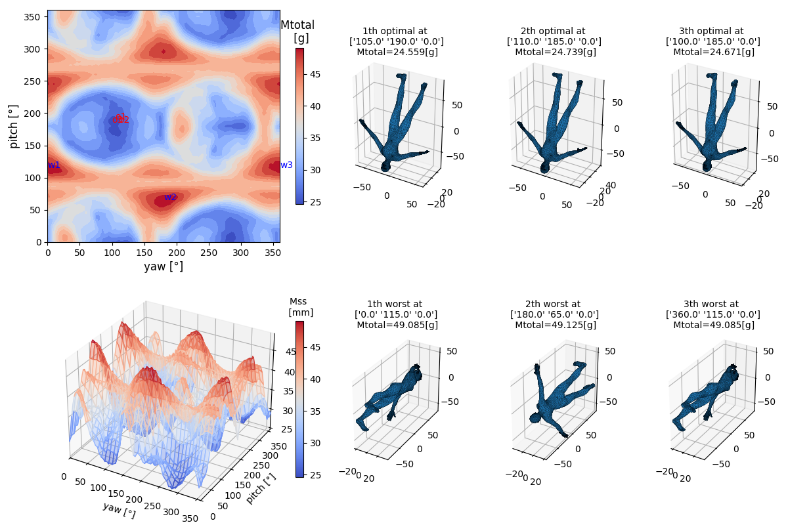
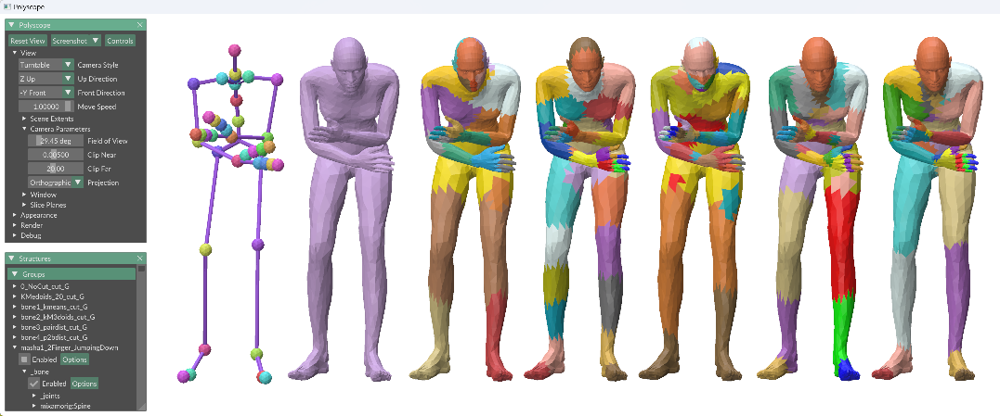
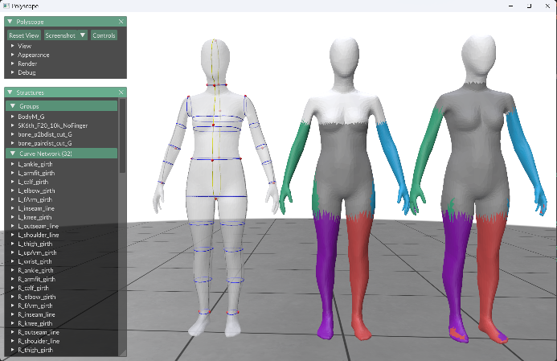

#### (공통) Python (버전 3.10, 3.11 또는 3.12) 에서 다음 패키지들을 설치합니다
```
pip install -r requirements(python3.10).txt
```

## TSE_TomoSh1.py
### 얇은 쉘 구조 마네킨 메쉬의 3D프린팅 필라멘트 소모량 예측
Filament Usage Prediction in 3D Printing  of Thin-Shell-Structured Manikin Mesh <br />
[한국섬유공학회지 2025-10](http://dx.doi.org/10.12772/TSE.2025.62.319) <br />
p.s. 
- open3d 패키지가 python 3.14에서 간혹 설치가 안 됩니다. opend3D는 python 3.12까지 지원합니다.
- GPU 버전은 현재 NVIDIA 4060, 4090에서만 테스트하였습니다. 5000번 시리즈는 아직 오류가 있어 실행이 안될 수 있습니다.


-------------


## TSE_TomoSh2.py
### 뼈대 구조와 군집 분석을 이용한 인체 마네킨의 최적 3D프린팅
Optimal 3D Printing of Human Manikin Using Bone Structure and Cluster Analysis <br />
[한국섬유공학회지 2025-12](http://dx.doi.org/10.12772/TSE.2025.62.337)




-------------


## TSE_TomoSh3.py
### 뼈대 구조와 군집 분석을 이용한 인체 마네킨의 최적 3D 모델링
User-Defined Three-Dimensional Human Body Measurement Using Bone Structure and Cluster Analysis <br />
[한국섬유공학회지 2025-12](http://dx.doi.org/10.12772/TSE.2025.62.337)



