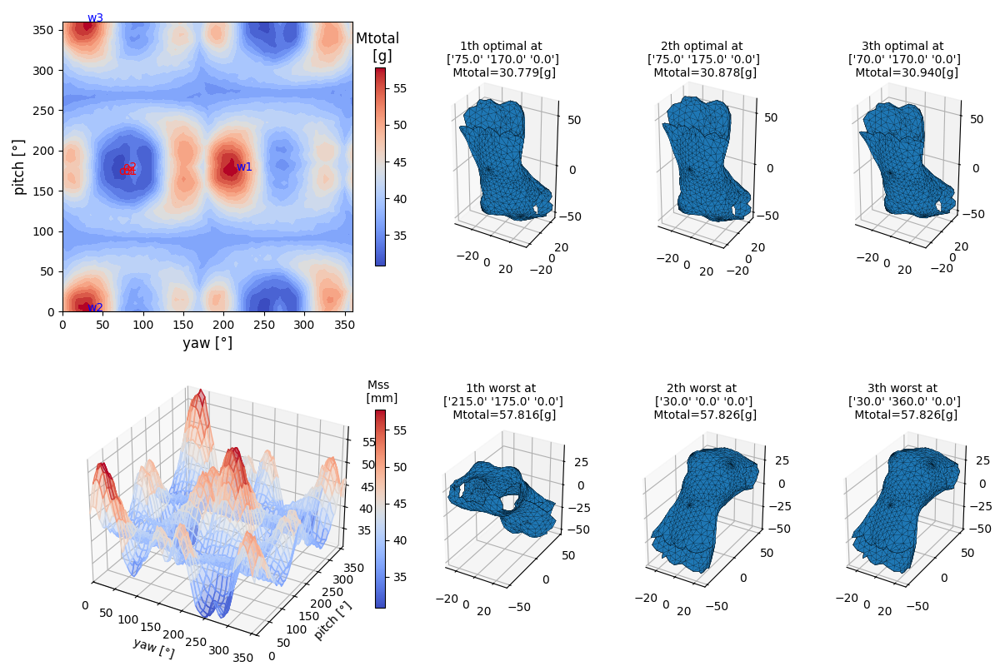
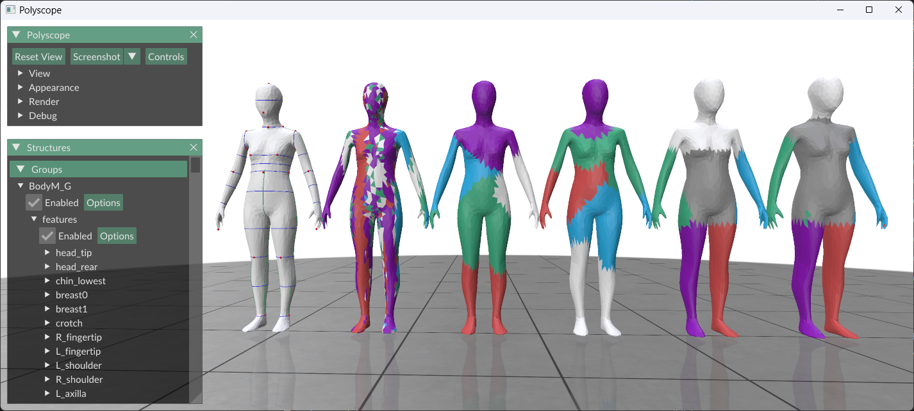

#### (공통) Python (버전 3.9.23) 에서 다음 패키지들을 설치합니다
(패키지 설치가 안되면 버전 번호를 빼고 그냥 설치해도 됩니다).
```
matplotlib==3.10.6
meshlib==3.0.7.226
networkx==2.5.1
numba==0.60.0
numpy==2.3.3
open3d==0.19.0
plotly==6.3.0
polyscope==2.5.0
potpourri3d==1.3
pyglm==2.8.2
pygltflib==1.16.5
recordtype==1.3
scikit_learn==1.7.2
scikit_learn_extra==0.2.0
scipy==1.16.2
trimesh==4.7.4
typed==0.6
```

# 얇은 쉘 구조 마네킨 메쉬의 3D프린팅 필라멘트 소모량 예측
Filament Usage Prediction in 3D Printing  of Thin-Shell-Structured Manikin Mesh
한국섬유공학회지 2025-08 submitted



#### "TSE_TomoSh1.py" 파일을 실행합니다.

##### GPU 버전은 현재 NVIDIA 4060, 4090에서만 테스트하였습니다. 5000번 시리즈는 아직 오류가 있어 실행이 안될 수 있습니다.

-------------
# 뼈대 구조와 군집 분석을 이용한 인체 마네킨의 최적 3D프린팅
Optimal 3D Printing of Human Manikin Using Bone Structure and Cluster Analysis
한국섬유공학회지 2025-08 submitted


#### "TSE_TomoSh2.py" 파일을 실행합니다.
-------------
# 뼈대 구조와 군집 분석을 이용한 사용자 정의 인체 자동 계측
User-Defined Three-Dimensional Human Body Measurement Using Bone Structure and Cluster Analysis

한국섬유공학회지 2025-09 submitted




#### "TSE_TomoSh3.py" 파일을 실행합니다.

